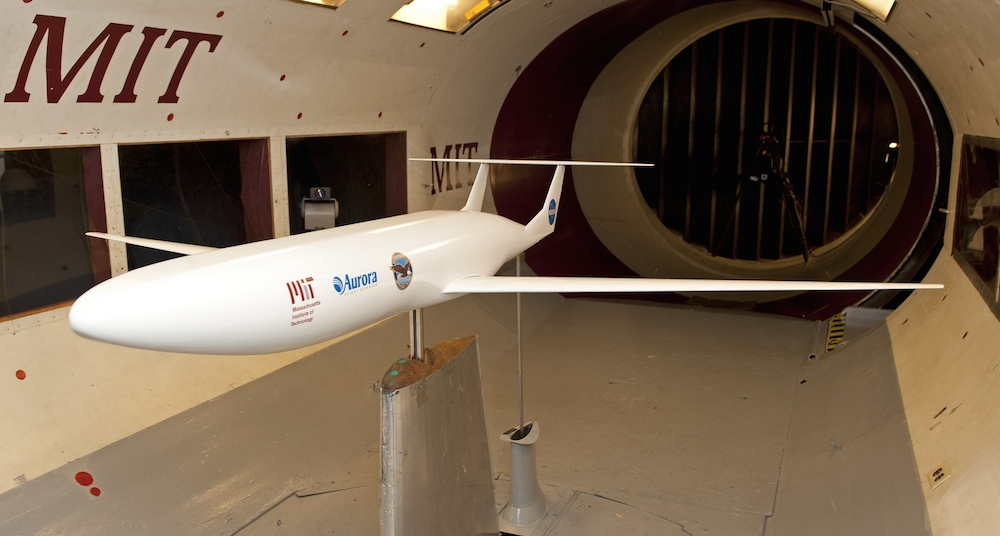
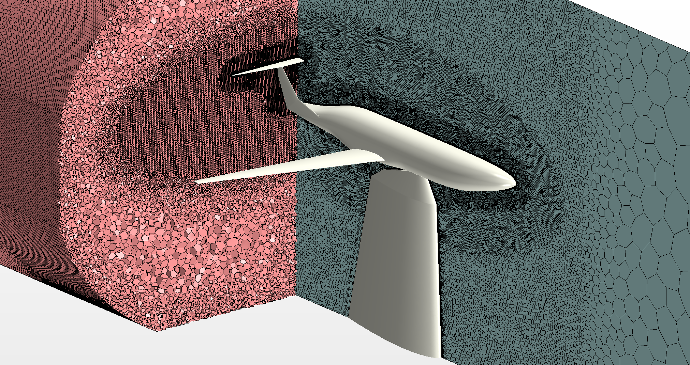
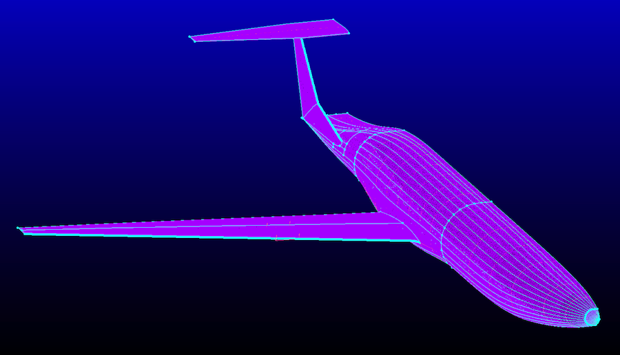
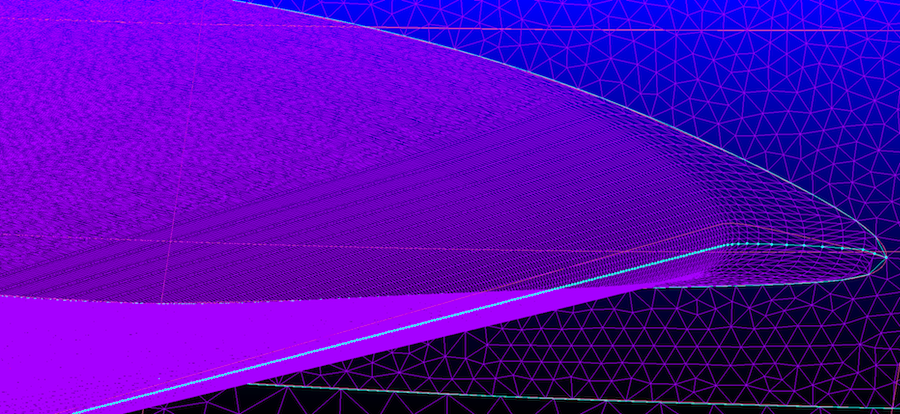
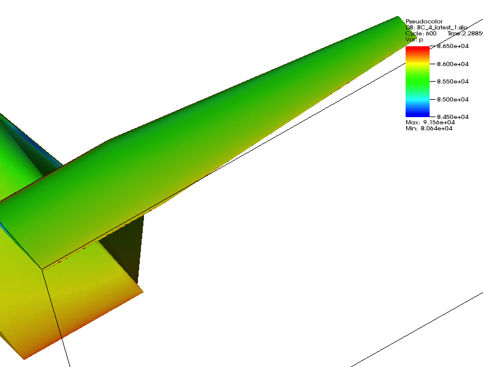
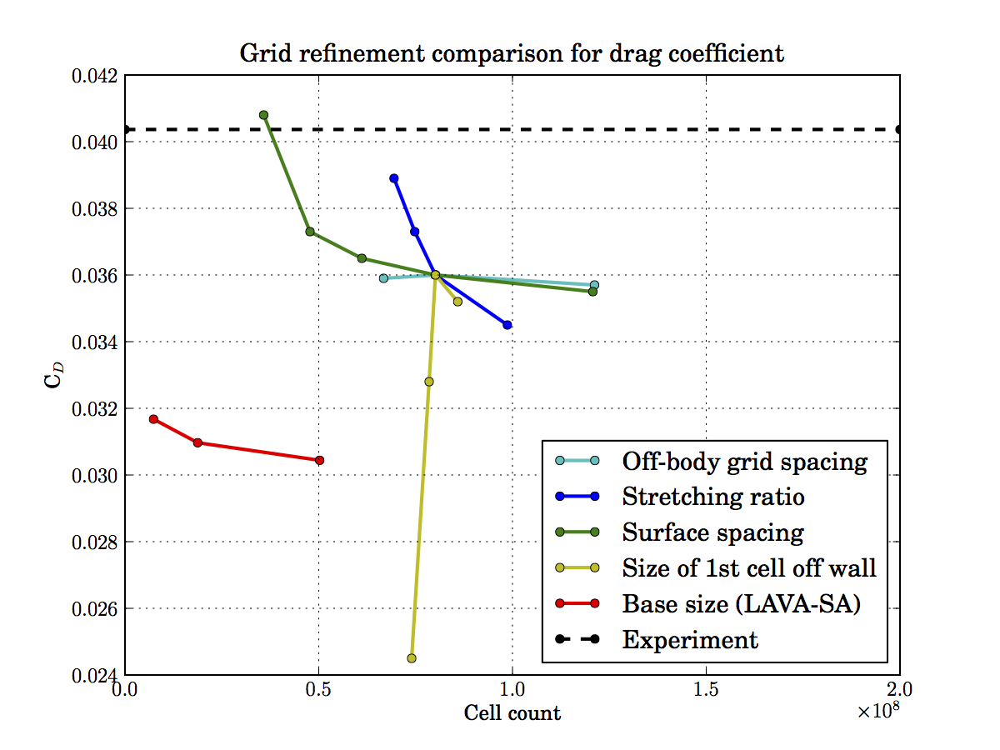
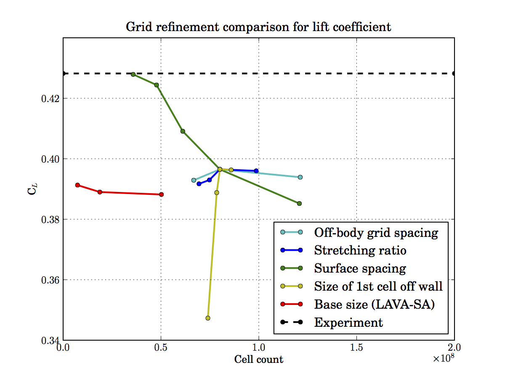
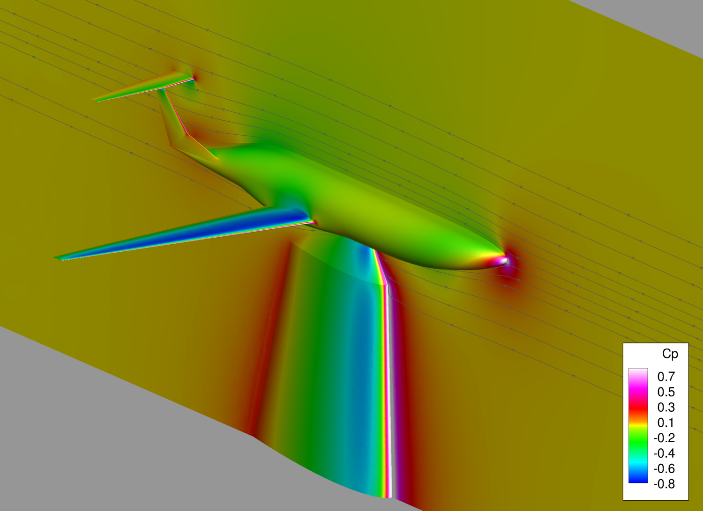
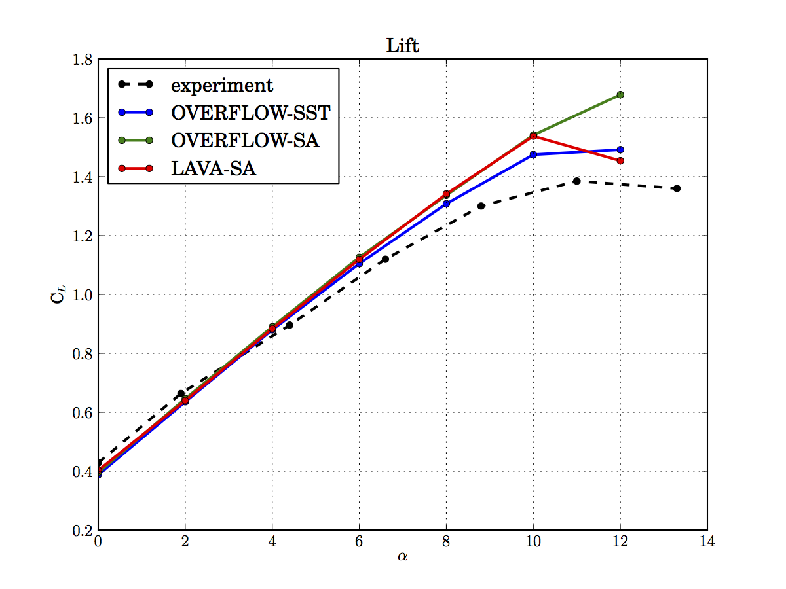
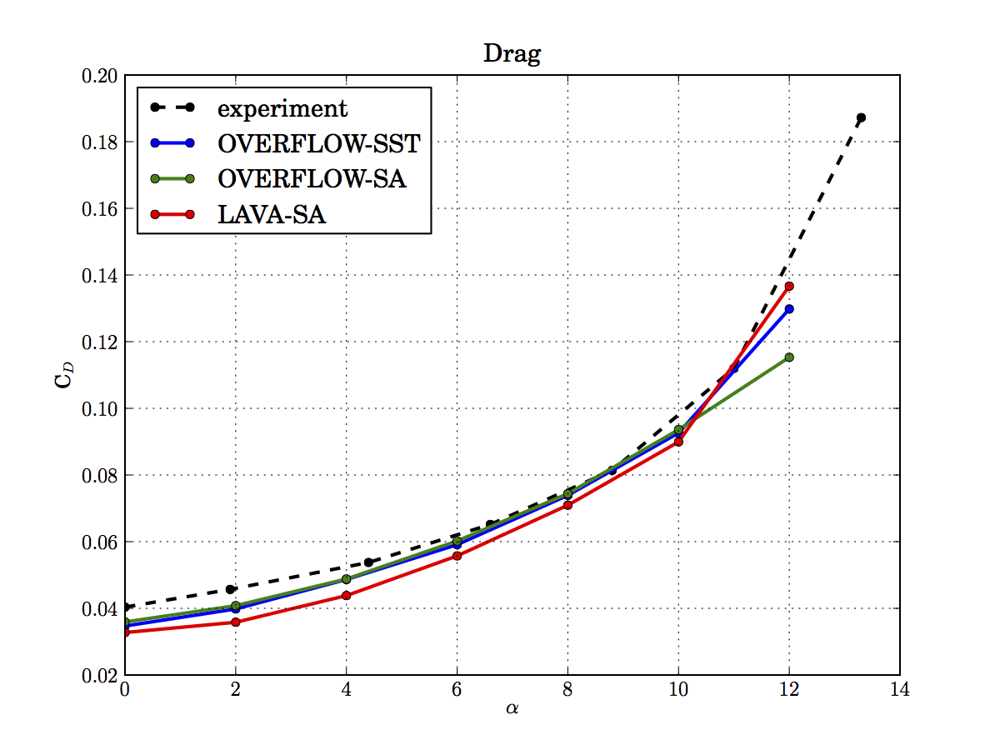

# Aerodynamics Simulations for the D8 "Double Bubble" aircraft using LAVA

_In the summer of 2013, I worked at NASA's Ames Research Center near Mountain View, California. I carried out simulations of the D8 aircraft using a new fluid code that had been developed in-house. It was a great 10 weeks. I made some great friends, hung out in San Francisco, went to Yosemite... and wrote a gripping 10-page report._

[TOC]

The D8 "double bubble" is a proposed design to reduce emissions and noise in domestic passenger aircraft of the Boeing 737 class. It features boundary layer-ingesting engines located under a non-load-bearing $\pi$-tail and a lightweight low-sweep wing, with a cruise speed of Mach 0.7. The D8's wide body supplies more lift than that of the Boeing 737, and its tapering rear thickens the boundary layer for ingestion by engines with distortion-tolerant fans. To investigate these claims, unstructured viscous grids generated over a fine surface triangulation using Star-CCM+ are used to model the unpowered 1:20 scale D8 with flow conditions mimicking those in the MIT Wright brothers wind tunnel at angles of attack from 0 to 12 degrees. LAVA, the Launch Ascent and Vehicle Aerodynamics CFD solver, is used to carry out simulations on unstructured grids. Unstructured results are compared to wind tunnel data, and to data from structured overset grid solutions obtained with LAVA and OVERFLOW.

## Introduction

The D8 aircraft design was proposed by MIT in 2010 for the NASA Fundamental Aeronautics Program's N+3 effort under the Fixed Wing Project, which aims to satisfy air transportation needs and achieve greater fuel efficiency in the 2030–35 timeframe. The D8 is a proposed solution for domestic flights carrying up to 180 passengers within a range of 3,000 nautical miles at Mach 0.72. It is intended to match the transportation abilities of the Boeing 737.
        
The design repurposes many parts of the traditional passenger aircraft. Most importantly:

- The wide fuselage supplies 15% of the total lift, compared to 8% for the Boeing 737
- The tapering rear end of the fuselage increases local boundary layer thickness and aligns airflow, enabling a lighter nacelle design and greater propulsive efficiency through Boundary Layer Ingestion
- Engine placement atop the fuselage shields noise from the ground
- The yaw moment produced by one engine in the event of the other's failure is much smaller than that of a wing-mounted engine configuration, allowing for a tail of reduced size and weight
- A low-sweep wing with a large coefficient of lift—lacking engines, requiring fewer support structures, and further conserving weight

The $\pi$-tail of the D8 plays many roles. It creates a negative moment which produces a positive pitch in the aircraft, and supplements the nacelles in aligning airflow, which the fuselage slows to an advantageous Mach 0.6 at cruising speeds.\cite{drela}

The D8 design has a number of different versions. In the D8.0, nacelles are mounted under each wing, serving to compare the new hull design more directly with that of the Boeing 737. The more promising D8.2 employs two nacelles mounted on top of the rear of the fuselage, below the $\pi$-tail. Wind tunnel tests and CFD simulations have been carried out using the unpowered version of the D8.2 geometry at a scale of 1:20. Testing will continue in August 2013 in the 14'x22' wind tunnel at the NASA Langley Research Center with a larger (1:11 scale model) to begin investigating the D8.2 configuration in greater detail.

__The unpowered 1/20 scale D8 model in the MIT Wright brothers wind tunnel. (MIT)__

CFD simulations have been carried out on the unpowered D8 geometry using the Cart3D and OVERFLOW solvers, with validation against wind tunnel results and investigation of flow characteristics such as boundary layer thickness near the trailing edge of the fuselage.\cite{pandya}

Unstructured grid generation is emerging as a more automated and efficient strategy to set up CFD simulations. LAVA, the Launch Ascent and Vehicle Aerodynamics CFD solver, is able to carry out simulations on both structured and unstructured grids. This paper details an effort to use Star-CCM+ and Pointwise to generate unstructured grids for simulation with the LAVA solver, and compare the numerical results to data from MIT's Wright brothers wind tunnel (WBWT) and to the previously generated OVERFLOW solutions\cite{pandya}. Finally, the overset grids generated for the OVERFLOW runs were also used to compute solutions with LAVA's structured flow solver. The LAVA unstructured results are compared on top and bottom of the aircraft with OVERFLOW and  LAVA structured results.

## CFD methods

Computational fluid dynamics extends the concept of control volumes used in fluid mechanics to simulate flow. This is done by dividing up the volume around the model using a grid. Many different solvers can then resolve attributes of the flow using the Navier–Stokes equations, and assumptions such as inviscid or irrotational flow make it possible to simplify them. However, viscous forces are important for the D8, for example in the boundary layer near the trailing edge of the fuselage which influences airflow to the engines. The codes used in this paper show steady-state behavior, as carried out by Pandya\cite{pandya}, with the Reynolds-Averaged Navier–Stokes (RANS) equations:

$$\rho\bar u_j \frac{\partial \bar u_i }{\partial x_j} = \rho \bar f_i
+ \frac{\partial}{\partial x_j} \left[ - \bar p\delta_{ij} + \mu \left( \frac{\partial \bar u_i}{\partial x_j} + \frac{\partial \bar u_j}{\partial x_i} \right)- \rho \overline{u_i^\prime u_j^\prime} \right]$$

where the change in mean momentum on the left hand side is equal to the sum of the forces exerted by the body, pressure field stress, viscous stresses, and the Reynolds stress term $-\rho u_i^\prime u_j^\prime$, which can be supplied by different turbulence models. LAVA unstructured simulations were run using 640 Sandy Bridge cores on NASA's Pleiades supercomputer, with a wall-clock time between 4 and 6 hours. The solver outputs data for the pressure, velocity, and temperature of the airflow on the surface of the model and in the entire volume of the simulation. It also gives details about the pressure coefficient $C_p$, lift coefficient $C_L$, drag coefficient $C_D$, and loadings on various parts of the model. These values are obtained when the results of the time-averaged simulation become stable, and is said to converge. If the results begin to differ wildly, the solver detects that the simulation has begun to diverge.

The flow conditions match those of the of 1:20 scale model tested in the MIT Wright brothers wind tunnel at 120 mph (Mach 0.16) and a Reynolds number of approximately $3\cdot 10^6$ per meter. Steady, turbulent flow was assumed and simulated using the Spalart–Allmaras model.

### Overflow

OVERFLOW is a NASA-developed viscous Reynolds Averaged Navier-Stokes (RANS) flow solver used for high Reynolds number turbulent flows using structured overset grids. The solver is made parallel through domain decomposition and uses the MPI message passing standard. Time accurate unsteady simulations can be completed using dual-time stepping schemes. The code originated as an outgrowth of the earlier CFD solvers F3D and ARC3D to evaluate the aerodynamics of the Space Shuttle launch vehicle. OVERFLOW is a vertex-based, finite difference solver and can be utilized for stationary grids or dynamic grid motions.\cite{nichols} Among OVERFLOW's many options for schemes, the D8 solutions for the 1:20 scale WBWT comparison runs were computed using central difference on the right-hand-side and approximate factorization on the left hand side with scalar artificial dissipation.

### LAVA

LAVA is a CFD solver developed in the Applied Modeling and Simulation Branch at NASA Ames Research Center. The LAVA framework is being developed with the emphasis on solving steady and unsteady multi-physics problems. The numerical algorithms are being designed to achieve fast turn-around times. Optimally laying out the data structure based on the underlying mesh being solved on is a key aspect for achieving fast turn-around times. The LAVA solver is highly flexible with respect to the computational mesh. It supports block-structured Cartesian meshes with Adaptive Mesh Refinement (AMR), immersed-boundary capabilities, structured curvilinear overset meshes, unstructured arbitrary polyhedral meshes and hybrid grid coupling.\cite{shayan} The focus of this work is the use of the unstructured, polyhedral mesh capability, but solutions using the structured overset capability were also obtained for comparison.

## Grid Generation

Unstructured meshes are being developed as an efficient strategy to create volume grids for CFD simulations, avoiding the manual setup time required for structured simulations. The tradeoff is that the finite volume method used for unstructured simulations is computationally less efficient than the finite difference method used by structured solvers.
        
The unusual geometry of the D8 proved to be a challenge for unstructured volume grid generation. Star-CCM+ initially generated some negative-volume cells around the leading and trailing edges of flight surfaces. Pointwise was then used to manually create surface meshes for Star-CCM+, which then generated volume grids that yielded diverging solutions. After a sharp edge in the balance beam was fixed and a finer starting geometry was obtained, the whole grid generation process was successfully completed in Star-CCM+.

__An unstructured volume grid made in Star-CCM+ with prism layers growing off the surface of the model.__

Without cross-flow, symmetry can be assumed, and half-body cases give accurate results. This assumption makes using higher-resolution grids more economical.
        
The polyhedra in the volume grid become finer as we approach the aircraft in order to resolve more interesting details of the flow where it changes most. Right near the surface, they have a very flat shape because we expect large changes in pressure, velocity, etc. in the direction perpendicular to the flow. These thin polyhedra make up prism layers, which provide the resolution necessary to properly capture the effect of the boundary layer.
        
Unstructured grids may be filled with tetrahedra or polyhedra. Tetrahedra are more likely to be skewed, which poses difficulties for flow solvers. Using polyhedra usually results in a more isotropic grid with a larger number of neighbors per cell.

## Geometry

The original geometry of the D8 contains a "triple-point" where the trailing edge of the vertical tail joins that of the fuselage. In order to make unstructured grid generation more robust, all components of the tail were moved forward by 0.25 in. In previous simulations by Pandya\cite{pandya}, the tail was displaced by 0.45 in, and differences between all geometries were assumed to be negligible.

### Star-CCM+

__The final unstructured grid for the D8 (medium resolution).__

Star-CCM+ was used for unstructured polyhedral grid generation, and initially failed to produce an adequate volume grid. The surface mesh generator in Star-CCM+ created overlapping cells on the leading edge of the wing. When LAVA simulations were carried out on these grids, cells on the balance beam and at the trailing edges of flight surfaces had greatly differing values for pressure and other attributes. The original geometry proved to be too coarse, and an attempt was made to refine it with Pointwise (see subsection C.). A higher-resolution geometry was obtained, and the balance beam supporting the model was fixed in Pointwise by creating a surface mesh from its original NACA airfoil. Finally, an elliptical region around the D8 was used for preliminary grid refinement, and Star-CCM+ successfully generated volume grids of varying refinement.
        
### Pointwise

__Coons Patch used to create a surface mesh on the fuselage using Pointwise.__

After facing difficulties generating a volume grid in Star-CCM+ alone, Pointwise was used to create a surface mesh by hand. Another problem with the geometry arose at the beginning, in which Pointwise was unable to generate a surface mesh on the fuselage of the aircraft. To fix this, curves defining the surface were exported from Overgrid and used with the Coons Patch tool in Pointwise, which interpolates the curves with smooth surfaces.

__The T-Rex mesh at the leading edge of the wing.__

Pointwise also has a feature called T-Rex (3D anisotropic tetrahedral extrusion) which makes it possible to create narrow, structured cells in important areas like the leading and trailing edges of the wing, tail, and fuselage.

## Results

### LAVA Unstructured

__Star-CCM+__

Simulations using the original geometry were found to diverge and showed problems around the trailing edge of the wing.

__Surface pressure distribution at the trailing edges of the initial D8 volume grid produced in Star-CCM+.__

Simulations of the Star-CCM+ volume grids converged using the LAVA unstructured flow solver at coarse, medium, and fine mesh resolutions, permitting the following grid refinement study at an angle of attack of $0^\circ$: 

__Lift and drag coefficients as functions of cell count for OVERFLOW and LAVA unstructured.__

In Fig. 7., results from Pandya\cite{pandya} in all colors other than red show simulation results as individual parameters of the grid are altered. The base size parameter in Star-CCM+ used to generate the coarse, medium and fine grids (red-colored data from left to right in Fig. 7. (a) and (b)) changes the off-body grid spacing, which also causes the surface spacing to change in response. In subfigure (a) we see that the medium grid produces results for $C_L$ as accurately as the fine grid, and observe that for $C_D$ there is a somewhat larger 3\% difference between medium and fine results. For all LAVA results, while the lift is approximately the same as that predicted by OVERFLOW, the drag is lower by approximately 10\%. Since all computational results are lower than the experiment, further investigation is needed to determine solution validity.

__$C_p$ surface distribution plot with streamlines indicated on symmetry plane.__

Fig. 8. shows the pressure coefficient surface distribution for the D8 at $\alpha = 0^\circ$, and an angle of attack sweep was carried out using LAVA unstructured with the Spalart--Allmaras turbulence model.

__$C_L$ and $C_D$ from various codes compared to WBWT exeperiment. LAVA unstructured results obtained for $\alpha$ ranging from $0^\circ$ to $12^\circ$ with $2^\circ$ increments. All but red data is from Pandya\cite{pandya}.__

In Fig. 9. (a) we see that LAVA follows OVERFLOW-SA closely until $\alpha = 12^\circ$, at which point lift from LAVA drops and drag rises in contrast to the OVERFLOW results. In Fig. 9. (b) we see the LAVA solutions predict lower $C_D$ values than the other codes until $\alpha = 12^\circ$.
