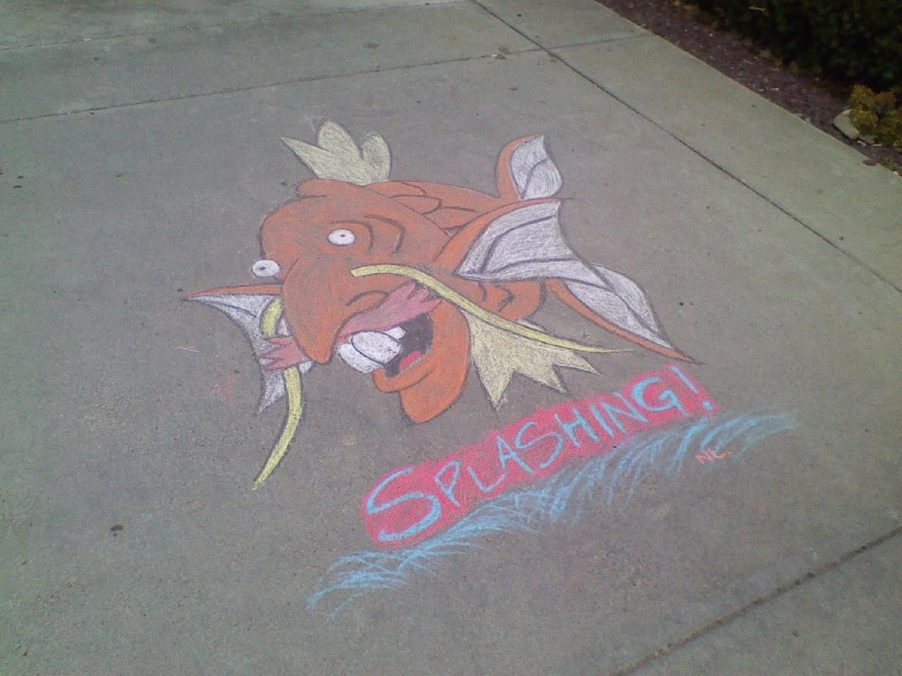

<!--{"date_written": "Jan 16"}-->

# First page

With some content or other.

# Second Page

| Tables        | Are           | Cool  |
| ------------- |:-------------:| -----:|
| col 3 is      | right-aligned | $1600 |
| col 2 is      | centered      |   $12 |
| zebra stripes | are neat      |    $1 |

HTML SVG:

<svg width="600" height="320">
  <circle cx="250" cy="210" r="100" stroke="red" stroke-width="1" fill="red" style="fill-opacity:0.1;"/>
  <circle cx="350" cy="210" r="100" stroke="blue" stroke-width="1" fill="blue" style="fill-opacity:0.1;"/>
  <circle cx="300" cy="110" r="100" stroke="turquoise" stroke-width="1" fill="turquoise" style="fill-opacity:0.1;"/>
  <text x="390" y="230" fill="red" text-anchor="middle">A</text>
  <text x="300" y="80" fill="red" text-anchor="middle">B</text>
  <text x="210" y="230" fill="red" text-anchor="middle">C</text>
  <text x="300" y="180" fill="red" text-anchor="middle">A &#x2229; B &#x2229; C</text>
</svg>

## Asdf

UTF-8: 燕雀安んぞ鴻鵠の志を知らんや

### Asdfasdf

MathJax align:

$$\begin{align}
i\hbar\frac{\partial}{\partial t} \Psi(\mathbf{r},t) &= \left [ \frac{-\hbar^2}{2m}\nabla^2 + V(\mathbf{r},t)\right ] \Psi(\mathbf{r},t)\\\\
f(x) &= \frac1x
\end{align}$$

Inline math: $x^2$.

The Hitchhiker's Guide to the Galaxy has a few things to say on the subject of towels. A towel, it says, is about the most massively useful thing an interstellar hitchhiker can have. Partly it has great practical value. You can wrap it around you for warmth as you bound across the cold moons of Jaglan Beta; you can lie on it on the brilliant marble-sanded beaches of Santraginus V, inhaling the heady sea vapors; you can sleep under it beneath the stars which shine so redly on the desert world of Krakafoon; use it to sail a miniraft down the slow heavy River Moth; wet it for use in hand-to-hand combat; wrap it round your head to ward off noxious fumes or avoid the gaze of the Ravenous Bugblatter Beast of Trall...

"fancy quotation marks"

> A towel, it says, is about the most massively useful thing an interstellar hitchhiker can have. Partly it has great practical value.

The Hitchhiker's Guide to the Galaxy has a few things to say on the subject of towels. A towel, it says, is about the most massively useful thing an interstellar hitchhiker can have.

- items
- in
- a
- list
    - indented

`inline_code` and _italics_ and __bold__

    def mdToHTML(text):
        text = fancyQuotes(text)
        # Markdown extensions 'codehilite' and 'meta' also available.
        text = markdown.markdown(text, ['tables', 'footnotes'])
        text = centerLaTeX(text)
        return text

