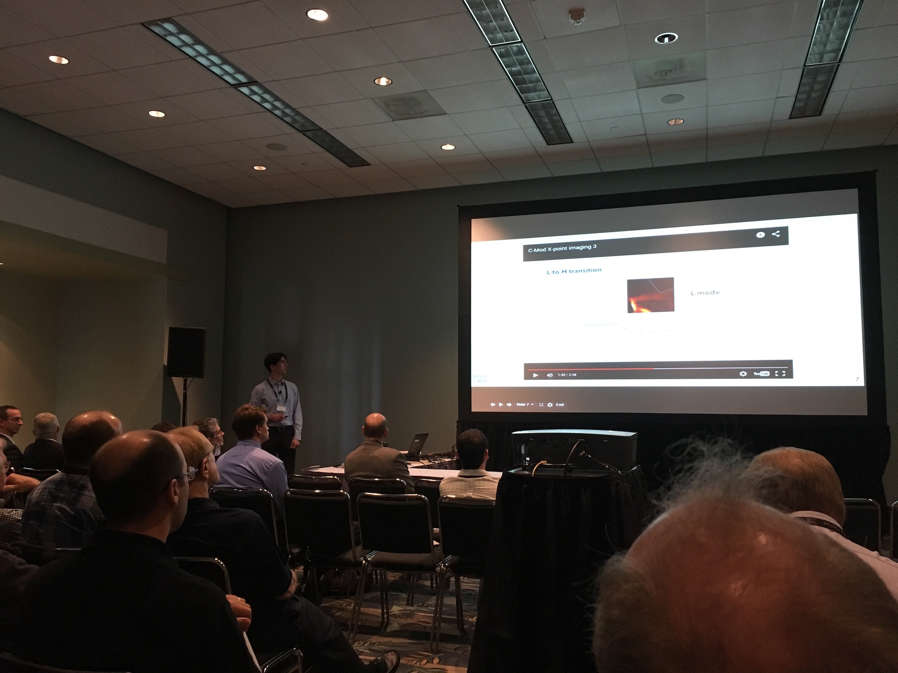
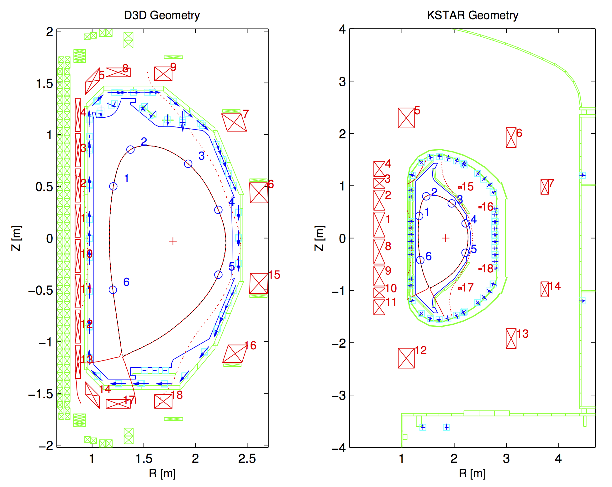
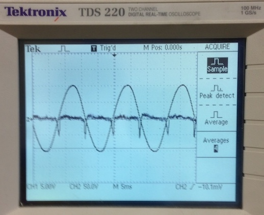
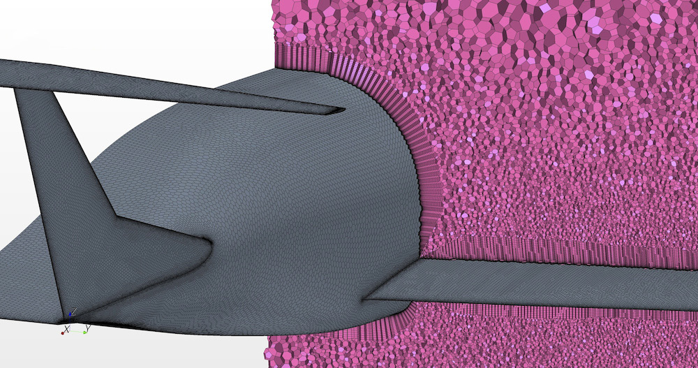
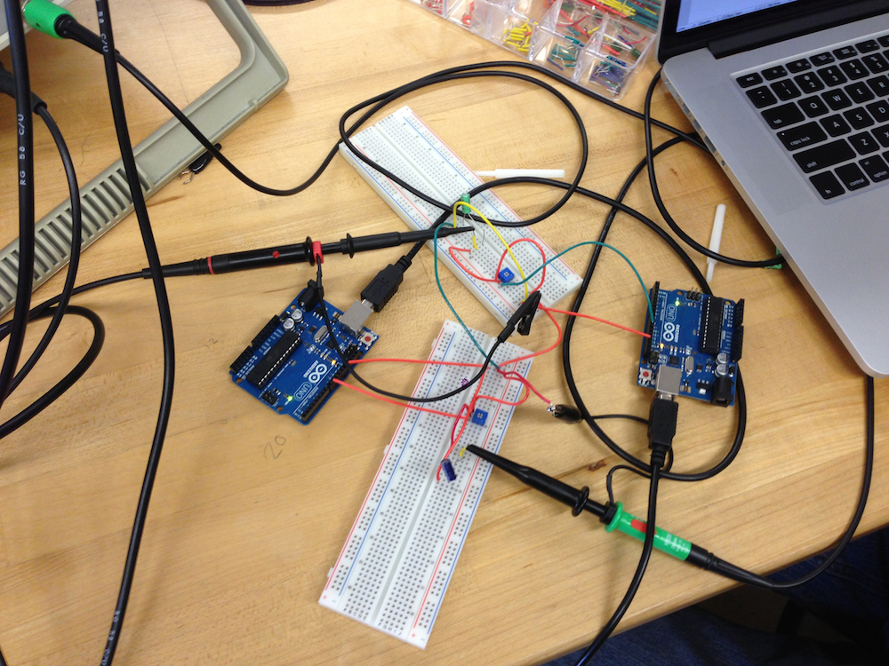
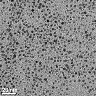

# Papers, posters, and talks

## Fast Imaging of X-point Plasma Turbulence [<i class="fa fa-television" style="font-size:.9em;"></i>](https://docs.google.com/presentation/d/1L4ZWVGMUMs7WpfBKkYcwPdrfSc9M8fNJAeG0rojuWwA/pub)

MIT Plasma Science and Fusion Center, Cambridge, MA. Summer 2015.

_Contributed Talk, APS Division of Plasma Physics 2015 Meeting_ [<i class="fa fa-link"></i>](http://www-internal.psfc.mit.edu./research/alcator/pubs/APS/APS2015/Savannah2015index.html)

Captured footage of turbulence in the divertor region of the Alcator C-Mod tokamak at 400,000 fps, revealing filaments aligned with the magnetic field that move perpendicularly to it at speeds of around 1 km/s.

## Optimizing Plasma Boundary Control in Superconducting Tokamaks [<i class="fa fa-map-o" style="font-size:.9em;"></i>](dpp-poster.pdf)

General Atomics, San Diego. Summer 2014.

_Outstanding Undergraduate Poster Award, APS Division of Plasma Physics 2014 Meeting_ [<i class="fa fa-picture-o"></i>](outstanding-poster-award.jpg)

Helped develop a metric to quantify a tokamak's ability to control its plasma. Built on existing Matlab simulations of tokamaks to automate tuning of the plasma control system normally done by trial and error. 

## Observation of the Classical and Quantum Hall Effects [<i class="fa fa-file-text-o" style="font-size:.9em;"></i>](qhe-lab.pdf)

Intermediate Physics Laboratory, Columbia University. Spring 2014.

## Nuclear Magnetic Resonance [<i class="fa fa-file-text-o" style="font-size:.9em;"></i>](nmr-lab.pdf)

Intermediate Physics Laboratory, Columbia University. Spring 2014.

## Aerodynamics Simulations of the D8 “Double Bubble” Aircraft [<i class="fa fa-file-text-o" style="font-size:.9em;"></i>](d8-sim.pdf)

NASA Ames Research Center, Moffett Field. Summer 2013.

Ran fluid simulations of a wind tunnel test on NASA's Pleiades supercomputer using the new LAVA code on an unstructured mesh. Unstructured meshes, like the one shown above, can be created automatically given a model, as opposed to structured overset grids, which are usually made by hand. The D8 is a passenger aircraft concept that could take on the role of the Boeing 737 by 2035.

## Pong [<i class="fa fa-file-text-o" style="font-size:.9em;"></i>](pong.pdf)

Intro to Electrical Engineering, Columbia University. Winter 2012.

Used two Arduinos to simulate a ball bouncing around an oscilloscope screen, and an array of LEDs hooked up to an Arduino to do the same thing.

## Enhancing a Hydrogen PEM Fuel Cell Stack with Gold-Dodecanethiolate Core-Shell Nanoparticles [<i class="fa fa-file-text-o" style="font-size:.9em;"></i>](intel_au-nps.pdf)

Garcia MRSEC program at Stony Brook University, NY. Summer 2011.

_Intel Science Talent Search semifinalist_

Added a gold nanoparticle catalyst to hydrogen fuel cell membranes arranged in a stack. The stack configuration is how fuel cells are used in the real world, whereas laboratories commonly test single cells.
